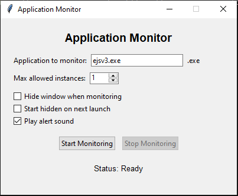

# 🚨 Application Monitor - Sakpan Na!


A powerful monitoring tool that **detects multiple instances** of any application and delivers **full-screen warnings with sound alerts** when limits are exceeded. Perfect for enforcing single-instance policies or monitoring critical applications.

 

## 🔥 Features

- **Custom Full-Screen Alerts** with your personalized warning message
- **Sound Notification** (WAV format supported)
- **Configurable Instance Limits** - Set how many copies are allowed
- **Stealth Mode** - Runs hidden in the background
- **Auto-Start Monitoring** - Launch minimized if preferred
- **Configuration Persistence** - Remembers your settings

## 📜 The Legendary Warning Message

When violations occur, users see:

SAKPAN NAKA AYAW PANIKAS!

KLARO KAAYO KA SA CCTV
OG MAKITA NAKO SA IMONG SCREEN
KUNG UNSA IMO GI BUHAT!


...along with a blaring alarm sound 🔔

## 🛠 Installation

1. **Prerequisites**:
   - Python 3.7+
   - Windows OS (Linux/macOS may work with pygame)

2. **Install dependencies**:
   ```bash
   pip install psutil pygame

## 🛠 Downlaod

git clone https://https://github.com/3dm4rk/detector
cd application-monitor


## 🚦  Usage

Run the application:

bash
python checker.py
Configure:

Enter application name (e.g., notepad.exe)

Set maximum allowed instances

Choose preferences:

Hide window

Start minimized

Sound alerts

Click Start Monitoring

⚙️ Configuration
The app automatically creates app_monitor_config.json with your settings:

json
{
  "app_name": "notepad.exe",
  "max_instances": 1,
  "hide_window": false,
  "start_hidden": false,
  "play_sound": true
}
🎨 Customization
Change Alert Sound:

Replace alert.wav with your own sound file

Must be in WAV format

Modify Warning Text:

Edit the text_lines array in show_warning_popup() method

📜 License
MIT License - Feel free to modify and distribute!

